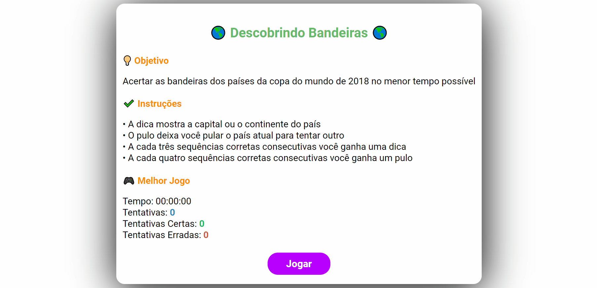
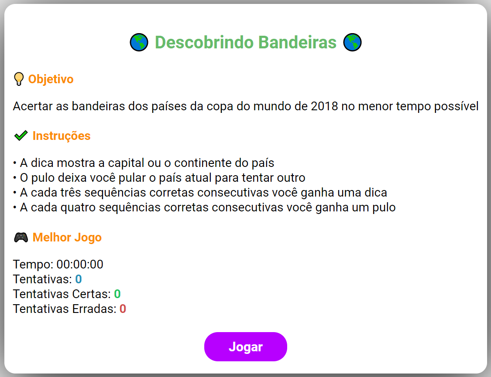
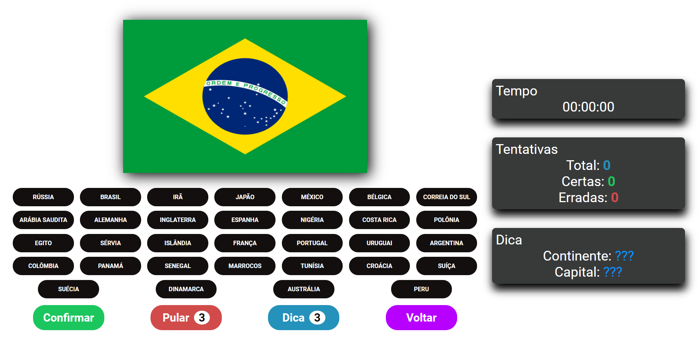

<h1 align="center">
  <p> 🌎 Descobrindo Bandeiras 🌎 </p>
</h1>



> Jogo simples desenvolvido com o intuito de aplicar conceitos estudados no desenvolvimento WEB com HTML, CSS e JavaScript

## 💻 Telas





## 🎯 Objetivo

Acertar as bandeiras dos países que participaram da copa do mundo de 2018 no menor tempo possível.

## 📌 Intruções

- A dica mostra a capital ou o continente do país.
- O pulo deixa você pular o país atual para tentar outro.
- A cada três sequências corretas consecutivas você ganha uma dica.
- A cada quatro sequências corretas consecutivas você ganha um pulo.

## 🎈 Como executar ?

1. Faça um clone do repositório:

    ```sh
    $ git clone https://github.com/Pedro-Manoel/jogo-descobrindo-bandeiras.git
    ```

2. Entre na pasta do projeto:

    ```sh
    $ cd jogo-descobrindo-bandeiras
    ```

3. Com acesso a internet abra o arquivo `index.html` no seu navegador

## 📃 Licença

Esse projeto está sob a licença MIT. Veja o arquivo [LICENSE](LICENSE) para mais detalhes.
